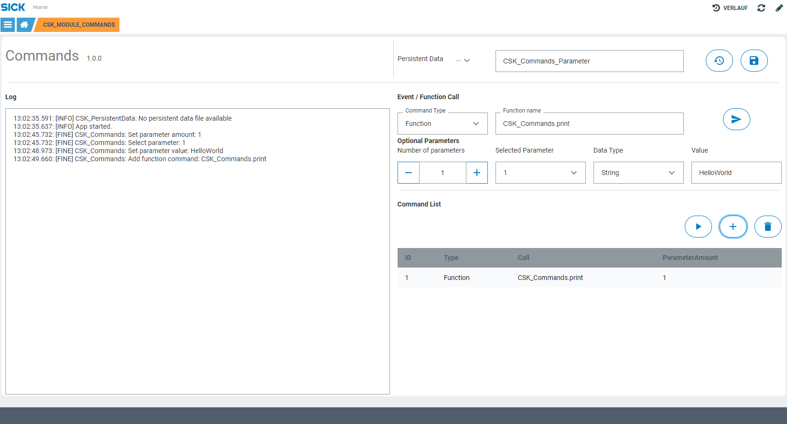

# CSK_Module_Commands
## INFO: Draft version. Not further developed / tested so far! Check for available GitHub forks of this repository to see latest updates.

Module to provide the possibility to execute dynamic function calls via UI during runtime.

## How to Run

[***...please fill with informations...***]  
For further information check out the [documentation](https://raw.githack.com/golluroSICKAG/CSK_Module_Commands/main/docu/CSK_Module_Commands.html) in the folder "docu".

## Information

Tested on:
|Device|Firmware|Module version
|--|--|--|
|e.g. SICK AppEngine|V1.5.0|V0.1.0|

This module is part of the SICK AppSpace Coding Starter Kit developing approach.  
It is programmed in an object-oriented way. Some of the modules use kind of "classes" in Lua to make it possible to reuse code / classes in other projects.  
In general, it is not neccessary to code this way, but the architecture of this app can serve as a sample to be used especially for bigger projects and to make it easier to share code.  
Please check the [documentation](https://github.com/SICKAppSpaceCodingStarterKit/.github/blob/main/docu/SICKAppSpaceCodingStarterKit_Documentation.md) of CSK for further information.  

## Topics

Coding Starter Kit, CSK, Module, SICK-AppSpace, Debug, Function, Call
